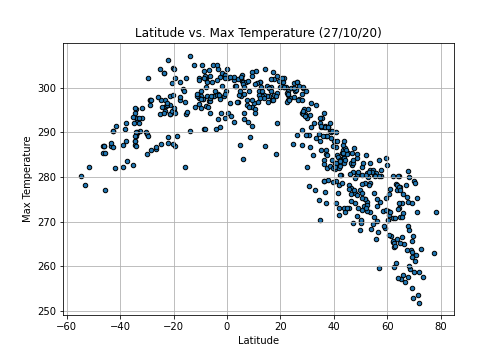
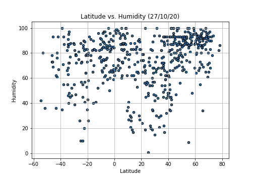
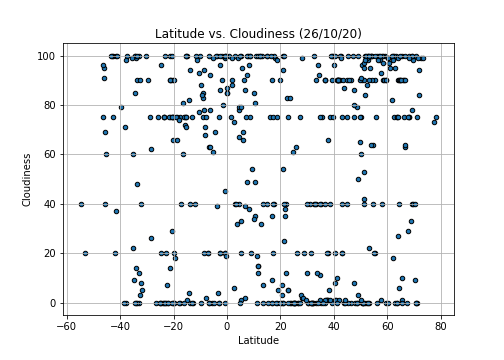
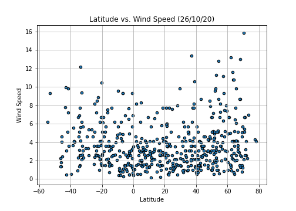

# Python API Challenge
I strive to achieve the totality, however I think there may be some details about centering the maps and some details that by doing an in-depth study on APi´s can be improved.

**An important note is that both require the famous api_keys that are personal and that are essential for the call of both implemented APi´s, within each folder there is a file called api_keys in which the personal api must be entered respectively.**

Something to mention is to consider the response time of the Weather Api, although there are not thousands of records it takes time for the response.

In detail, the challenge consists of two objectives to call it WeatherPy and VacationPy.

Continuing the dependencies of both is found in each Resources folder.

## WeatherPy

For WeatherBY we see a dataset obtained from an approximate random of more than 500 cities to be evaluated for topics such as Humidity, Cloudiness, Latitude, etc.

Derived from the API call, the information used for comparisons and the following requested graphics is complemented:

Temperature (F) vs. Latitude

Humidity (%) vs. Latitude

Cloudiness (%) vs. Latitude

Wind Speed (mph) vs. Latitude

Additional obtains as output a file that is used for the part of VacationPy that is saved in both Resources folders.

## VacationPY 

## Part I - WeatherPy

In this example, you'll be creating a Python script to visualize the weather of 500+ cities across the world of varying distance from the equator. To accomplish this, you'll be utilizing a [simple Python library](https://pypi.python.org/pypi/citipy), the [OpenWeatherMap API](https://openweathermap.org/api), and a little common sense to create a representative model of weather across world cities.

### Part II - VacationPy

  * Drop any rows that don't contain all three conditions. You want to be sure the weather is ideal.

  * **Note:** Feel free to adjust to your specifications but be sure to limit the number of rows returned by your API requests to a reasonable number.

* Using Google Places API to find the first hotel for each city located within 5000 meters of your coordinates.

* Plot the hotels on top of the humidity heatmap with each pin containing the **Hotel Name**, **City**, and **Country**.

  

