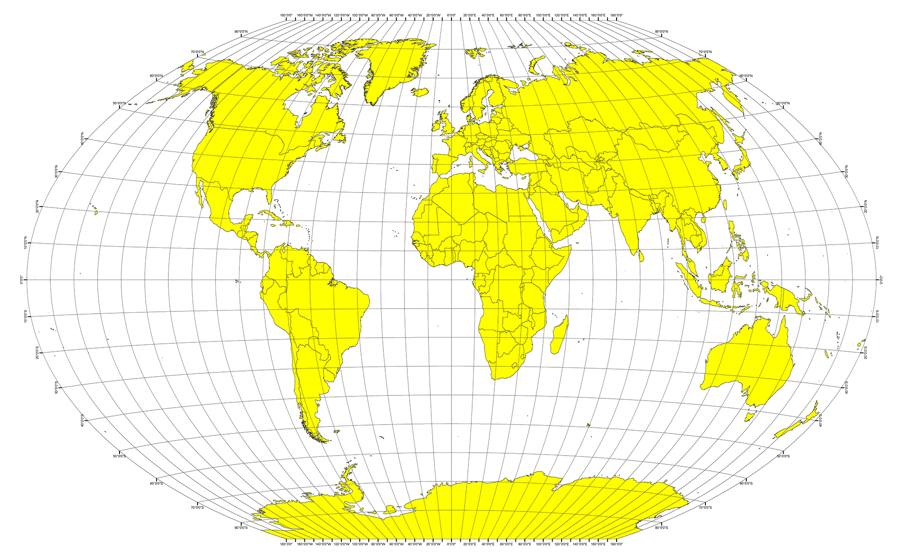

# Python API Challenge
I strive to achieve the totality, however I think there may be some details about centering the maps and some details that by doing an in-depth study on APi´s can be improved.

**An important note is that both require the famous api_keys that are personal and that are essential for the call of both implemented APi´s, within each folder there is a file called api_keys in which the personal api must be entered respectively.**

Something to mention is to consider the response time of the Weather Api, although there are not thousands of records it takes time for the response.

In detail, the challenge consists of two objectives to call it WeatherPy and VacationPy.

Continuing the dependencies of both is found in each Resources folder.

## WeatherPy

For WeatherBY we see a dataset obtained from an approximate random of more than 500 cities to be evaluated for topics such as Humidity, Cloudiness, Latitude, etc.

## VacationPY 

## Part I - WeatherPy

In this example, you'll be creating a Python script to visualize the weather of 500+ cities across the world of varying distance from the equator. To accomplish this, you'll be utilizing a [simple Python library](https://pypi.python.org/pypi/citipy), the [OpenWeatherMap API](https://openweathermap.org/api), and a little common sense to create a representative model of weather across world cities.

### Part II - VacationPy

  * Drop any rows that don't contain all three conditions. You want to be sure the weather is ideal.

  * **Note:** Feel free to adjust to your specifications but be sure to limit the number of rows returned by your API requests to a reasonable number.

* Using Google Places API to find the first hotel for each city located within 5000 meters of your coordinates.

* Plot the hotels on top of the humidity heatmap with each pin containing the **Hotel Name**, **City**, and **Country**.

  

## Hints and Considerations

* The city data you generate is based on random coordinates as well as different query times; as such, your outputs will not be an exact match to the provided starter notebook.

* You may want to start this assignment by refreshing yourself on the [geographic coordinate system](http://desktop.arcgis.com/en/arcmap/10.3/guide-books/map-projections/about-geographic-coordinate-systems.htm).

* Next, spend the requisite time necessary to study the OpenWeatherMap API. Based on your initial study, you should be able to answer  basic questions about the API: Where do you request the API key? Which Weather API in particular will you need? What URL endpoints does it expect? What JSON structure does it respond with? Before you write a line of code, you should be aiming to have a crystal clear understanding of your intended outcome.

* A starter code for Citipy has been provided. However, if you're craving an extra challenge, push yourself to learn how it works: [citipy Python library](https://pypi.python.org/pypi/citipy). Before you try to incorporate the library into your analysis, start by creating simple test cases outside your main script to confirm that you are using it correctly. Too often, when introduced to a new library, students get bogged down by the most minor of errors -- spending hours investigating their entire code -- when, in fact, a simple and focused test would have shown their basic utilization of the library was wrong from the start. Don't let this be you!

* Part of our expectation in this challenge is that you will use critical thinking skills to understand how and why we're recommending the tools we are. What is Citipy for? Why would you use it in conjunction with the OpenWeatherMap API? How would you do so?

* In building your script, pay attention to the cities you are using in your query pool. Are you getting coverage of the full gamut of latitudes and longitudes? Or are you simply choosing 500 cities concentrated in one region of the world? Even if you were a geographic genius, simply rattling 500 cities based on your human selection would create a biased dataset. Be thinking of how you should counter this. (Hint: Consider the full range of latitudes).

* Once you have computed the linear regression for one chart, the process will be similar for all others. As a bonus, try to create a function that will create these charts based on different parameters.

* Remember that each coordinate will trigger a separate call to the Google API. If you're creating your own criteria to plan your vacation, try to reduce the results in your DataFrame to 10 or fewer cities.

* Lastly, remember -- this is a challenging activity. Push yourself! If you complete this task, then you can safely say that you've gained a strong mastery of the core foundations of data analytics and it will only go better from here. Good luck!

### Copyright

Trilogy Education Services © 2019. All Rights Reserved.
