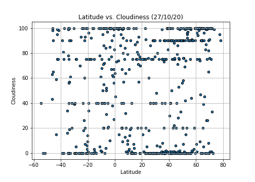
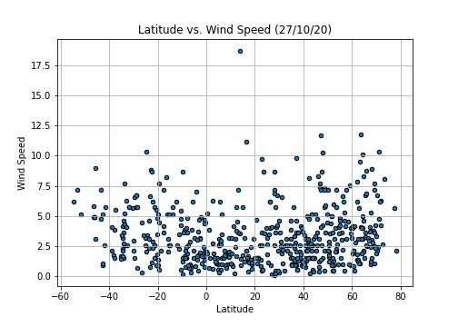

# Python API Challenge
I strive to achieve the totality, however I think there may be some details about centering the maps and some details that by doing an in-depth study on APi´s can be improved.

**An important note is that both require the famous api_keys that are personal and that are essential for the call of both implemented APi´s, within each folder there is a file called api_keys in which the personal api must be entered respectively.**

Something to mention is to consider the response time of the Weather Api, although there are not thousands of records it takes time for the response.

In detail, the challenge consists of two objectives to call it WeatherPy and VacationPy.

Continuing the dependencies of both is found in each Resources folder.

## WeatherPy

For WeatherBY we see a dataset obtained from an approximate random of more than 500 cities to be evaluated for topics such as Humidity, Cloudiness, Latitude, etc.

Derived from the API call, the information used for comparisons and the following requested graphics is complemented:

Temperature (F) vs. Latitude

Humidity (%) vs. Latitude

Cloudiness (%) vs. Latitude

Wind Speed (mph) vs. Latitude

Additional obtains as output a file that is used for the part of VacationPy that is saved in both Resources folders.

## VacationPY 

For VacationPy already implementing the file from part one, the interesting thing is the use of Google's API to show a HeatMap, I still had setbacks with the calls and with certain installations that were required (commented cell) so that both maps could be seen.
The interesting and basic note on each dataset to use is the records with nan to be removed to avoid future failures.
Within the conditions, it is mentioned restricting the information in order to find a suggested vacation place with the suggested conditions, however, when I wanted to implement all the conditions, my information was emptied, so only two conditions were occupied.

